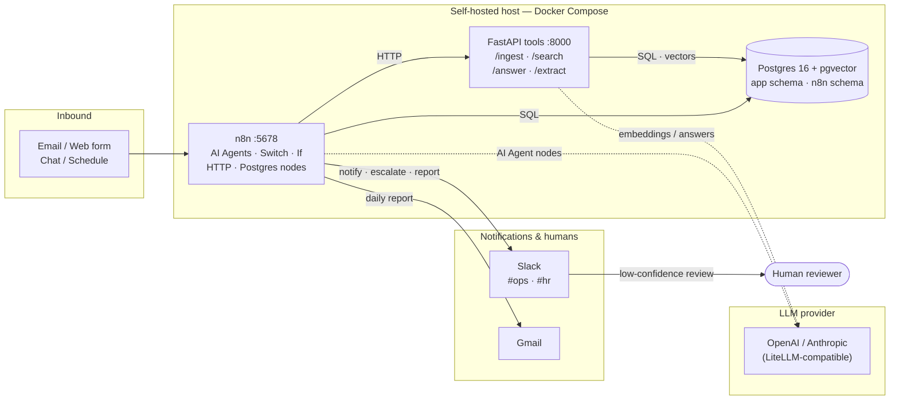

# AI Ops Automation Control Plane

[](https://github.com/esterkane/ai-ops-automation-control-plane/actions/workflows/ci.yml)

A self-hosted, on-premises AI workflow automation suite. It pairs **n8n** (visual
workflow orchestration) with a **FastAPI tools microservice** for the custom AI
logic — Retrieval-Augmented Generation over an internal knowledge base, document
extraction, and embeddings — backed by **Postgres 16 + pgvector**.

> Status: **complete** — infra, RAG knowledge base, document extraction, n8n
> workflows, and portfolio docs (Prompts 1–5). See the [case study](CASE-STUDY.md)
> and [security notes](SECURITY.md).

---

## Architecture



### Services

| Service    | Image / build              | Port  | Role |
|------------|----------------------------|-------|------|
| `n8n`      | `n8nio/n8n:latest`         | 5678  | Workflow orchestration, AI agent nodes, integrations. State stored in Postgres (`n8n` schema). |
| `postgres` | `pgvector/pgvector:pg16`   | 5432  | Metadata + RAG vector store (`app` schema). |
| `tools`    | local `./tools` FastAPI    | 8000  | Custom AI logic n8n calls over HTTP. |

---

## Quick start

```bash
cp .env.example .env       # then edit secrets
make up                    # build + start the stack
make logs                  # tail logs
make seed                  # load demo knowledge base (after Prompt 2)
make down                  # stop
```

### Local URLs

| What            | URL                              | Notes |
|-----------------|----------------------------------|-------|
| n8n editor      | http://localhost:5678            | Basic auth — `N8N_BASIC_AUTH_USER` / `N8N_BASIC_AUTH_PASSWORD` in `.env`. |
| Tools API       | http://localhost:8088            | Host port 8088 → container 8000. |
| Tools API docs  | http://localhost:8088/docs       | Swagger UI. |
| Tools health    | http://localhost:8088/health     | Liveness + provider check. |
| Postgres        | `localhost:55432`                | Host 55432 → container 5432. `POSTGRES_USER` / `POSTGRES_DB` in `.env`. |

> Host ports are remapped (8088, 55432) to avoid colliding with services already
> bound to 8000/5432 on the dev machine. Inside the compose network the services
> still talk to each other on their native ports (`tools:8000`, `postgres:5432`).

---

## RAG knowledge base API

The `tools` service exposes an evidence-first retrieval pipeline. Load the demo
knowledge base first (`make seed`), then:

| Endpoint | Method | Purpose |
|---|---|---|
| `/ingest` | POST | Chunk + embed text documents, upsert into pgvector (idempotent per `source`). |
| `/ingest/file` | POST | Same, for a single uploaded `.pdf`/`.txt`/`.md` file (`multipart/form-data`). |
| `/search` | POST | **Hybrid** retrieval: pgvector cosine + Postgres full-text, fused with reciprocal rank fusion. |
| `/answer` | POST | Answers **only** from retrieved context; returns citations + a `low_confidence` flag for human-in-the-loop escalation. |

```bash
# Ask a question (cited answer + confidence)
curl -s -X POST http://localhost:8088/answer \
  -H "Content-Type: application/json" \
  -d '{"query":"What is the refund window for monthly plans?"}'
```

```jsonc
{
  "answer": "... refund within 14 days of purchase ... (sources: [1], [2])",
  "citations": [{"source": "product_faq.md", "chunk_id": 12, "title": "...", "score": 0.0164}],
  "low_confidence": false,
  "confidence": 0.75
}
```

**Confidence** is the best of (vector cosine similarity, lexical term-coverage of the
top evidence). Answers below `RAG_LOW_CONFIDENCE_THRESHOLD` (default `0.35`) set
`low_confidence: true` — the signal the `rag-support-agent` n8n workflow routes on.

## Document extraction API

| Endpoint | Method | Purpose |
|---|---|---|
| `/extract` | POST | Accept an invoice/form PDF, pull structured fields (vendor, invoice number, dates, currency, total, line items), validate, flag missing fields, and persist valid invoices to `app.invoices`. |

```bash
curl -s -X POST http://localhost:8088/extract \
  -F "file=@tools/tests/fixtures/clean_invoice.pdf;type=application/pdf"
```

```jsonc
{
  "extraction": {
    "vendor": "ACME Industrial Supplies Ltd", "invoice_number": "INV-2024-0042",
    "invoice_date": "2024-05-17", "currency": "USD", "total": 268.80,
    "line_items": [{"description": "Steel brackets", "quantity": 10, "unit_price": 12.5, "amount": 125.0}]
  },
  "low_confidence": false, "missing_fields": [], "persisted": true, "invoice_id": 3
}
```

A document that isn't an invoice (no invoice number + total) is flagged
`low_confidence: true` and **not** persisted — no garbage rows. Sample PDFs live in
`tools/tests/fixtures/` (regenerate with `python -m scripts.make_sample_invoices`).

### Offline by default, real LLMs when keyed
With placeholder API keys the service uses a **deterministic local embedding** and an
**extractive answerer** so the suite is demoable with zero setup. Set a real
`OPENAI_API_KEY` (or `ANTHROPIC_API_KEY` + `LLM_PROVIDER=anthropic`) and it switches to
`text-embedding-3-small` and the chat model automatically — no code changes.

---

## Repository layout

```
ai-ops-automation-control-plane/
├── docker-compose.yml        # n8n + postgres(pgvector) + tools
├── Makefile                  # up / down / logs / seed / test / fmt
├── .env.example              # every required variable (copy to .env)
├── postgres/init/01-init.sql # schemas + documents/leads/tickets/invoices tables
├── tools/                    # FastAPI microservice
│   ├── app/                  # main, config, db, models, embeddings, llm, rag, extraction, service, seed
│   ├── scripts/              # make_sample_invoices.py (generates fixture PDFs)
│   └── tests/                # test_health, test_rag, test_extract (+ fixtures/, conftest)
├── workflows/                # n8n workflow JSON exports (Prompt 4)
├── docs/                     # diagrams, case study, security, screenshots
└── .claude/skills/           # the 5 build skills for this project
```

---

## What this demonstrates

| Skill demonstrated | Where it lives |
|---|---|
| **AI agents** | n8n AI Agent nodes in the [triage](workflows/inbound-triage-agent.json) and [daily report](workflows/ops-daily-report.json) workflows. |
| **LLM orchestration** | Provider-agnostic [`llm.py`](tools/app/llm.py) / [`embeddings.py`](tools/app/embeddings.py) (OpenAI/Anthropic + offline fallback). |
| **RAG with citations** | Hybrid retrieval ([`/search`](tools/app/db.py)) + grounded, cited [`/answer`](tools/app/service.py). |
| **Document automation** | [`/extract`](tools/app/extraction.py): invoice PDF → validated structured JSON → `app.invoices`. |
| **n8n automation** | Three [importable workflows](workflows/README.md) as code. |
| **API integration** | n8n HTTP Request nodes → FastAPI; Slack + Gmail nodes. |
| **Reporting automation** | Scheduled [ops daily report](workflows/ops-daily-report.md) → Slack + email. |
| **Notifications** | Slack `#ops` / `#hr` posts across workflows. |
| **Human-in-the-loop** | `low_confidence` flag → escalate instead of guessing ([rag-support-agent](workflows/rag-support-agent.md)). |
| **Self-hosting / security** | On-prem Docker Compose, gitignored secrets, localhost-bound DB — see [SECURITY.md](SECURITY.md). |

For the full story — problem, before/after, and outcomes — see the [case study](CASE-STUDY.md).

## Build skills

This repo ships with five Claude Code skills under `.claude/skills/` that build it
out phase by phase. Invoke them in order:

1. `/scaffold-infra` — Prompt 1: compose stack, DB init, FastAPI stub, env, Makefile (✅ done).
2. `/rag-knowledge-base` — Prompt 2: /ingest, /search (hybrid + RRF), /answer with citations (✅ done).
3. `/document-extraction` — Prompt 3: /extract invoices to structured JSON (✅ done).
4. `/n8n-workflows` — Prompt 4: three importable workflow JSON files + docs (✅ done).
5. `/portfolio-docs` — Prompt 5: README, case study, security doc, screenshot plan (✅ done).
